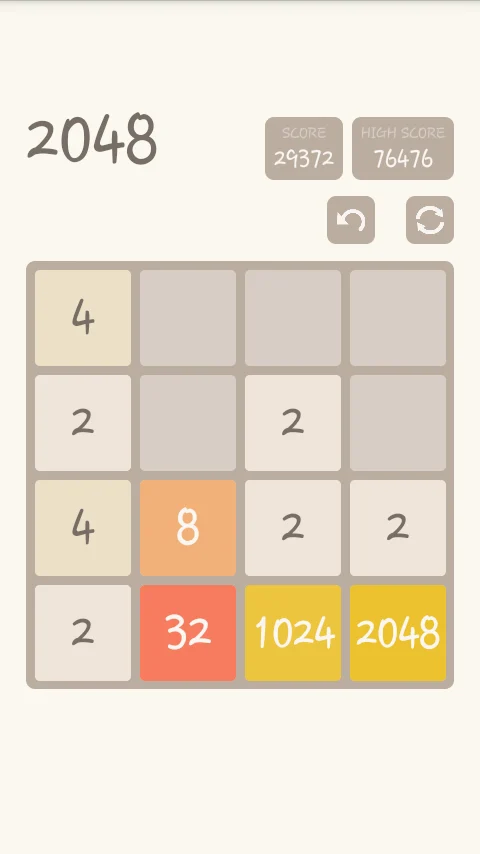

# Gamerina Vue.js Developer Test

## The Game of 2048

> 2048 is a game where you combine numbered tiles in order to gain a higher numbered tile. In this game you start with two tiles, the lowest possible number available is two. Then you will play by combining the tiles with the same number to have a tile with the sum of the number on the two tiles. A lot of strategies have been devised in order to obtain the 2048 and be a winner in this game. But others have strived for a greater height. Which is a score beyond 2048. After, achieving the tile with a 2048 tile, players will be asked if you still want to continue the game. Some stop there, but others are determined to continue.

### Develop the 2048 game using the following specs: 
- **Vue.js** for the front-end with states as data input
- build with **Webpack**
- use **LESS** for styling
- use a **Cloudflare worker** as a backend API
- the game must be responsive on every screen size

## Specifications
- Vue.js must interpret _**boardState**_ to render and animate elements
- _**boardState**_ is a 4x4 matrix with values **0<=x<=2048**, all multiple of **2**
- _**userAction**_ is a string that describes the direction in which the user swiped: _left_/_right_/_up_/_down_/
- The cloudflare worker receives _**{boardState, userAction}**_ and responds with _**{previousState, userAction, currentState}**_

## Start!
Fork this repository with your github account. Create a new branch with your name and start coding! When you're done, create a pull request.